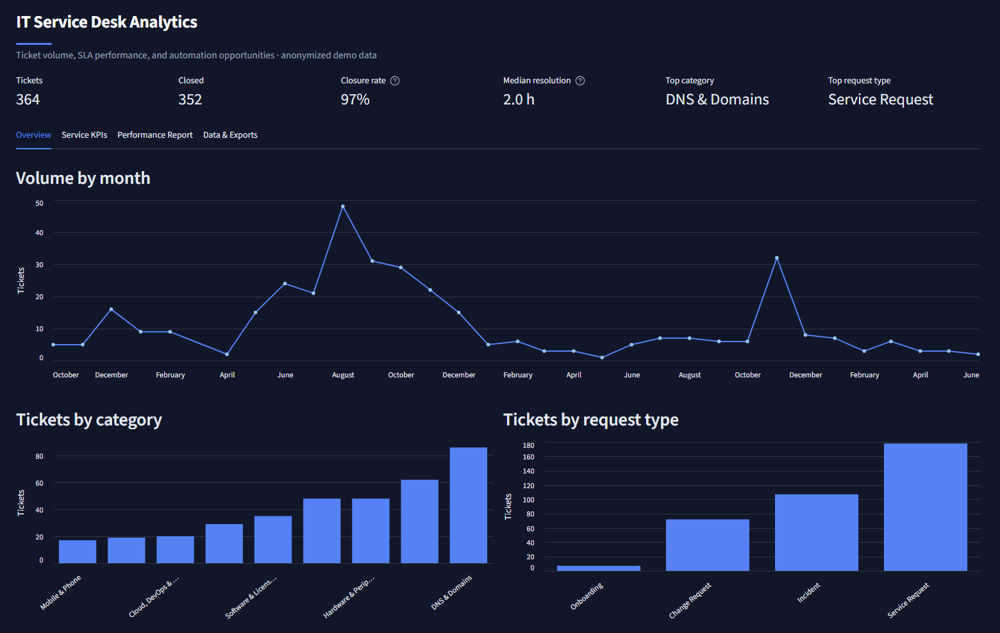

# Service Desk Analytics

A self-contained reporting system that turns a raw Spiceworks help-desk export into service KPIs,
an executive summary, and an interactive dashboard — with privacy-safe sanitization built in.

> **Built on real, sanitized tickets.** The bundled dataset (`sample_data/tickets_masked.csv`)
> is a real lifetime export from a help-desk queue I operate, put through `sanitize.py` first: requester
> emails become stable one-way hashes (`user_xxxxxxxx`), the IT team is reduced to aliases
> (`Tech A`, `Tech B`, …), and every free-text / infrastructure field (Summary, Description, IPs,
> hostnames, asset tags, ticket links, org name) is dropped before anything is analyzed. No names,
> emails, or internal details remain — so the analysis is grounded in real operations while staying
> safe to publish.

## Dashboard

A live, interactive version is deployed on Streamlit Community Cloud:

> **Live demo:** https://service-desk-analytics.streamlit.app/



Four tabs: **Overview** (volume trend + category / request-type breakdowns), **Service KPIs**
(SLA compliance, resolution times, throughput, backlog, priority mix), **Performance Report**
(headline KPIs with *what to watch* and recommended actions), and **Data & Exports** (executive
summary, top recurring issues, and downloads). Explore them all in the live demo above.

## Problem

A small IT team running a free, self-hosted ticketing tool (**Spiceworks**) is great at *working*
tickets but has little built in for *learning* from them. The queue captures requests reliably, but
the years of history it accumulates sit as a passive archive with no analytics layer on top. The
free tier ships no real reporting, so the practical ceiling is exporting a raw CSV and squinting at
it — which means basic operational questions go unanswered: what's actually driving volume, whether
response times are reasonable, where the backlog is aging, and which routine work is worth
automating. This project adds that missing layer: a repeatable way to turn an export into KPIs, an
executive summary, and a dashboard.

## Scope

**In scope**
- Ingesting a raw Spiceworks CSV export and de-identifying it safely.
- Re-tagging tickets into a current, consistent taxonomy (10 categories × 5 request types).
- Service KPIs: volume, resolution time, SLA compliance, throughput, backlog aging, workload.
- An automated, scheduled performance report with an executive summary and recommended actions.
- An interactive dashboard for exploring the queue and trying new exports.

**Out of scope**
- Real-time / live ticket integration (this works on periodic CSV exports).
- Text-mining the original ticket descriptions — those are dropped for privacy, so analysis is
  based on structured fields and the taxonomy, not free-text NLP.
- Per-ticket labor tracking — the export has no reliable time-spent field, so effort/savings figures
  use a clearly-stated, adjustable assumption.

## Why this solution fits

- **Small, low-volume queue (~8 tickets/month).** A heavyweight BI platform is overkill; a Python +
  Streamlit tool that runs from a CSV is proportional, free to host, and easy to maintain.
- **Privacy is non-negotiable.** Sanitization is the first step, not an afterthought, so the same
  artifact can be analyzed internally *and* shown publicly.
- **The audience is operational, not statistical.** Leadership needs "what's happening and what to
  do," so the system leads with an executive summary, KPIs, and recommended actions — and is honest
  that, at this volume, findings are directional rather than statistically robust.
- **Reporting should be automatic.** A scheduled annual/quarterly report replaces the manual
  spreadsheet and keeps cadence appropriate to the volume.

## Interactive dashboard

The primary interface. Runs the whole pipeline in the browser:

```bash
pip install -r requirements.txt
streamlit run dashboard.py
```

Drag in a Spiceworks export (raw or already-masked) and it sanitizes, re-tags, and analyzes on the
fly. Tabs: **Overview** (volume + breakdowns), **Service KPIs** (SLA, resolution, throughput,
backlog, priority mix), **Performance Report** (executive KPIs with *what to watch* / *recommended
actions*), and **Data & Exports** (executive summary, ticket preview, downloads). It includes
sidebar filters with a one-click reset, a downloadable sample CSV, and an upload self-check that
shows rows in/out, dropped columns, and a PII scan. Processing is fully local — nothing is uploaded.

### Deploy it free (Streamlit Community Cloud)

1. Push this `service-desk-analytics` folder to a GitHub repo (the bundled
   `sample_data/tickets_masked.csv` is safe to commit; `raw_export.csv` stays git-ignored).
2. At <https://share.streamlit.io>, sign in with GitHub → **New app**, point it at the repo, set
   **Main file path** to `dashboard.py`, deploy. Dependencies install from `requirements.txt`.
3. Visitors see the bundled anonymized data immediately and can upload their own export.

## Service KPIs & automated reporting

- **Volume** — total / closed / open, by period, category, request type, and priority
- **Resolution time** — median, mean, 90th-percentile, overall and by priority / category
- **SLA compliance** — % resolved within per-priority targets (urgent 4h, high 8h, medium 24h,
  low 72h; override in `kpis.DEFAULT_SLA_HOURS`)
- **Throughput** — created vs closed per month and net backlog change
- **Backlog aging** — open tickets bucketed by age
- **Workload** — distribution across (anonymized) technicians

Reporting defaults to **annual** cadence (a year ≈ 100 tickets here, enough to read); quarter and
month are available via `--freq`.

```bash
# latest period (annual by default)
python report.py --input sample_data/tickets_masked.csv --out output
# a specific period, or every period of a cadence
python report.py --input sample_data/tickets_masked.csv --period 2025 --out output
python report.py --input sample_data/tickets_masked.csv --freq quarter --period 2025Q4 --out output
python report.py --input sample_data/tickets_masked.csv --all --out output
```

Schedule it with Task Scheduler (Windows) or cron (Linux/macOS) to produce reporting automatically.

## Command-line pipeline

```bash
# 1. sanitize a raw Spiceworks export into a safe, analytics-ready CSV
python sanitize.py --input ticket-export.csv --output sample_data/tickets_masked.csv
# 2. analyze → charts + summary in output/  (also writes an SQLite db for plain-SQL queries)
python analyze_tickets.py --input sample_data/tickets_masked.csv --out output
```

`sanitize.py` reads columns by name, so it handles the full Spiceworks schema. For historical
tickets it applies the `ticket_categories.csv` map; for a new export it falls back to the export's own
Category / Request Type columns. Always eyeball the output before sharing.

## Iterations & improvements

Built incrementally; each pass sharpened either the analysis, the trust model, or the UX.

| # | Area | Improvement |
|---|------|-------------|
| 1 | Pipeline | Initial sanitize → analyze flow (charts + Markdown summary) |
| 2 | Privacy | Drop all free-text/infra fields; hash requesters; alias technicians; full PII scrub |
| 3 | Taxonomy | Re-tag every ticket into the current scheme (10 categories × 5 request types) via `ticket_categories.csv` |
| 4 | Data quality | Excluded Spiceworks welcome/test tickets that skewed resolution time (369 → 364) |
| 5 | KPIs | Added SLA compliance, resolution percentiles, throughput, backlog aging, workload |
| 6 | Reporting | Automated period report; cadence tuned monthly → quarterly → **annual** for a low-volume queue |
| 7 | Actionability | Period-over-period deltas, *What to watch* / *Recommended actions*, ROI/time-saved estimate with a documented deflection assumption |
| 8 | Dashboard | Streamlit app: tabbed layout, filters + reset, sorted charts, priority pie, sample-CSV download, upload self-check |
| 9 | Insight depth | Derived issue titles + "top recurring issues"; executive-summary redesign with KPI cards |
| 10 | Robustness | New-export fallback that canonicalizes the export's own Category / Request Type columns |
| 11 | Presentation | Dark, themed enterprise UI; widened layout; neutral product name and branding |

## Files

| File | Purpose |
|------|---------|
| `dashboard.py` | Streamlit app — the main interface (upload, KPIs, report, exports) |
| `kpis.py` | Service-desk KPIs: volume, resolution, SLA compliance, throughput, backlog aging, workload, savings opportunity |
| `report.py` | Automated performance report (Markdown) with period-over-period deltas |
| `sanitize.py` | Masks a raw Spiceworks export and applies the current tagging taxonomy |
| `ticket_categories.csv` | Per-ticket mapping of historical tickets to the current taxonomy |
| `analyze_tickets.py` | Batch CLI: load → SQLite → charts + summary |
| `sql/queries.sql` | The same analyses as plain SQL (run against `output/tickets.db`) |
| `sample_data/tickets_masked.csv` | Anonymized, re-tagged real dataset (364 tickets) the app runs on |
| `sample_data/sample_spiceworks_export.csv` | Synthetic raw export showing the expected upload format |
| `requirements.txt` | pandas, matplotlib, streamlit |

> `raw_export.csv` and the `output/` folder are git-ignored — the raw, unmasked export never leaves
> your machine.

## Requirements

- Python 3.9+
- `pandas`, `matplotlib`, `streamlit` (see `requirements.txt`)

## License

MIT — see [LICENSE](LICENSE).
